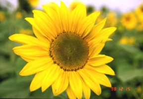

# 影片疊合（加密）
Combine(
    ,
    ) =
    
  

Trans(
    )=
    

- 將B影片加密流程
  - 尋找一個A影片
  - 將A影片和B影片合併得到C影片
  - 將轉換器(trans)保存作為鑰匙

# 圖片疊合（加密）
Combine(
    ,
    ) =
    
  

Trans(
    )=
    

- 定義 A (tiger) , B (flower)
    
  - 合併A與B得到C(看起來像B)
  - 將C過轉換器得到C_bar看起來像C)
  - C與C_bar透過轉換器可無損轉換1

- 原理
  - 將圖片轉換乘bit plane ,將令一張圖片壓縮至bit plane後面層，bit plane的特性 後面層對顯示的影像較小，因此可能儲存資訊，本專案做了三種合成器。

- 三種加密方式
  - method1 :[A8 A7 A6 A5 B5 B6 B7 B8]
  - method2 :[A8 A7 A6 00 00 B6 B7 B8]
  - method3 :[A8 A7 A6 A5 A4 A3 X1 X2]
   #X1=[B8,B6,B4]的壓縮 X2=[B7,B5,B3]的壓縮 

# 改善空間

- 通用性

本專案使用FFV1編碼方式儲存成avi檔，目前還無法使用有損方式儲存影片，原因很簡單，因為儲存資料的方式是使用bit plane將資訊藏在淺層，而淺層的資料不太影像畫質，因此在一般如mp4v等編碼方式容易損失我所想保存的重要資訊，因此暫時還無法儲存成.mp4這種更通用的檔案。

- 保密性

只要展開乘bit plane 其實很容易看出隱藏資訊，這個解法有很多，例如打亂儲存，將打亂的規則記在轉換器裡，這樣展開乘bit plane就不會直接看到怎藏資訊了，但在本專案並無打亂儲存位置，因此這是可以優先改善的問題，畢竟相較於第一點更容易改善。